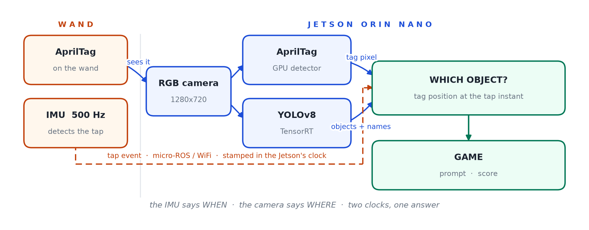

# tap-dance

Whack-a-mole on real objects. The game calls one out — *"tap the CUP"* — you bring a
tagged wand over it and tap. **The IMU says when you tapped, the camera says where the
wand was, and neither can answer alone.**

## Demo

*(video to be added)*

## Hardware

| | |
|---|---|
| Compute | Jetson Orin Nano — JetPack 6.2, ROS 2 Humble, Isaac ROS 3.2 |
| Camera | Intel RealSense D456, webcam-style on the desk |
| Wand | M5StickC Plus2 (ESP32 + MPU6886 IMU) with an AprilTag, micro-ROS over WiFi |

No depth is used — only the colour stream — so **any RGB camera should work**, given a
`camera_info` topic for AprilTag and control over exposure.

## Pipeline



## Run it

```bash
# micro-ROS agent — on the host, persistent. Outside the ROS launch on purpose: the
# wand connects to it whenever it powers on, game or no game.
docker run -d --restart unless-stopped --net=host \
  --name uros_agent microros/micro-ros-agent:humble udp4 --port 8888

# firmware (needs include/secrets.h)
cd firmware/m5stick_imu && pio run -t upload
```

Then, in the Isaac ROS container, one command:

```bash
ros2 launch tap_dance tap_game.launch.py tag_size:=0.1225 use_yolo:=true \
  yolo_classes:='["cup","banana","apple"]' wand_tag_id:=1
```

YOLOv8 finds and names the objects. To skip it and give positions by hand:

```bash
ros2 launch tap_dance tap_game.launch.py tag_size:=0.1225 \
  target_names:='["cup","pen"]' target_u:='[600.0, 1000.0]'
```

Watch **`/game/overlay`** in a Foxglove Image panel — the camera view with the prompt
and score drawn on. **The room needs to be well lit:** exposure is pinned short to stop
the tag blurring during the reach, so a dim room costs detections.

## Docs

- [`docs/design.md`](docs/design.md) — how it works and why
- [`docs/runbook.md`](docs/runbook.md) — commands, tuning knobs, gotchas
